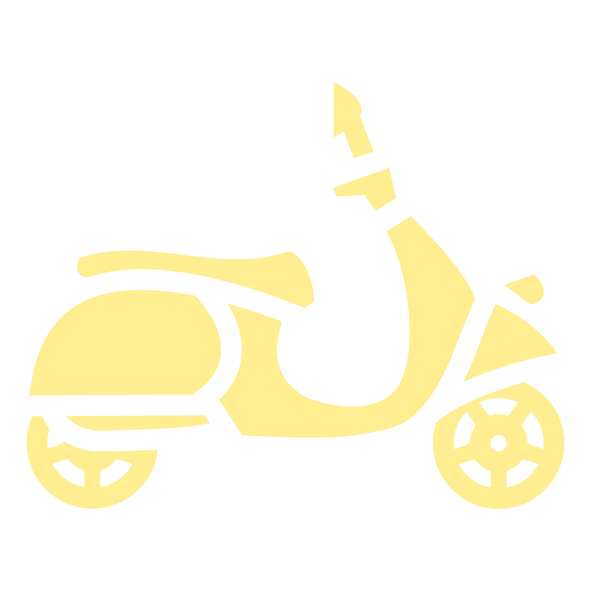

# 🐒 Monkey Battle 🐒

> [English](README.md) | [繁體中文]

這款遊戲的靈感來自**新楓之谷**同人小遊戲**Maple Cut**，採用滑鼠進行攻擊，並以數字鍵12345來切換技能。  

遊戲內容靈感來自作者的大學生活，因作者就讀於高雄「猴子大學」，在生活中時常需要與猴子打交道，且周遭時常有同學遭到猴子欺負，  
學校已然受到猴子的**入侵**，進而有了「學生保衛猴子攻擊學校」的有趣想法。  

在以此想法為基礎上，作者創作出了這款遊戲。  

遊戲使用Python 3以及Python套件─pygame來撰寫，分為兩階段製作：  
> 1. 最初製作於 **2024 年 7 月** ，這階段採用純手刻，沒有使用任何的AI工具進行輔助。2024年的作品連結：  
> 2. 在 **2026 年 3 月** Vibe Coding流行後，使用 Antigravity 等AI工具進行二次修改，並重構整個專案架構，提升程式的可擴性以及可維護性。   

---

## 遊玩方式

1 2 3 4 5：切換技能

滑鼠左鍵：施放技能

---

## 技能說明
#### 1. 鉛筆射擊


- 說明：最基本的攻擊，消耗AP向鼠標方向射出一支鉛筆，能與接觸到的子彈互相抵消。
- AP消耗：10
- 傷害：1
- 冷卻：跟隨動畫限制
- 獲得等級：1

#### 2. 丟書


- 說明：消耗MP向鼠標方向丟出一本書，能消除接觸到的所有子彈(例如：banana、stone…等等)，並對命中的單位(除了monkeyKing)造成「重擊」，使其短暫停止行動，若正處於攻擊狀態，會強制取消。
- MP消耗：10
- 傷害：3
- 冷卻：跟隨動畫限制
- 獲得等級：3

#### 3. 課桌椅障礙物


- 說明：消耗MP，從玩家上方的教學大樓落下一堆課桌椅到玩家身前，對命中的猴子造成大量傷害，並形成障礙物。近戰攻擊優先攻擊課桌椅障礙物，且其能阻擋子彈。擁有隨時間減少的生命值，當生命值歸零時消失。
- MP消耗：25
- 傷害：10
- 冷卻：20秒
 - 生命值：15
- 每秒生命值衰減：1
- 獲得等級：6

#### 4. 休息時刻


- 說明：玩家進行休息，期間不能進行任何操作，也不會被中斷。休息結束後，回覆一定的生命值。
- 回復生命值：10+當前等級
- 冷卻：20秒
- 獲得等級：10

#### 5. 機車衝擊


- 說明：以猴子對付猴子。消耗75%最大AP和75%最大MP，啟動機車向前衝鋒，命中猴子後發生爆炸，造成大量傷害。
- AP消耗：75%最大AP
- MP消耗：75%最大MP
- 傷害：20
- 冷卻：30秒
- 獲得等級：15

---

## 下載方式
點選github頁面右側的release，可下載最新版本的.exe檔案。

---

## 程式架構說明
### loading page

- 初始化頁面，在此頁面進行preloading，將遊玩過程會使用到的.png、.wav...等等檔案事先從Disk載入到RAM中，可避免遊玩過程因 page fault 而發生卡頓的情形。  
- 載入完成後點擊畫面可進入menu page。  
  
### menu page

- 遊戲主視覺頁面，透過調整star的opacity來達到閃爍的特效。
- 在此頁面可以進入setting page以及game page。

### setting page

- 供玩家調整畫面幀數。

### game page

- 遊戲階段。

### end page

- 結算畫面。

---

## 檔案結構
```
\---Monkey Battle
    |   .gitattributes
    |   .gitignore
    |   function.py
    |   LICENSE
    |   main_icon.ico
    |   MonkeyBattle.py
    |   README.md
    |   school.png
    |
    +---.agents
    |   +---rules
    |   +---skills
    |   |       SKILL.md
    |   |
    |   \---workflows
    +---angelMonkey
    |       ...
    |
    +---BGM
    |       JustAnotherMapleLeaf.mp3
    |       Motivation.mp3
    |
    +---bigWhiteMonkey
    |   |   bigWhiteMoneky.png
    |   |
    |   +---die\...
    |   |
    |   +---jumpAttack\...
    |   |   |
    |   |   \---dust\...
    |   |
    |   +---move\...
    |   |
    |   +---shootAttack\...
    |       \---seed\...
    |
    +---config
    |       settings.json (參數控制)
    |       waves.json (每波次怪物數量)
    |
    +---core
    |       engine.py
    |       resource_manager.py
    |       state_machine.py
    |
    +---effects
    |       animations.py
    |
    +---entities (sprite程式碼)
    |       angel_monkey.py
    |       base.py
    |       big_white_monkey.py
    |       magician.py
    |       menu_objects.py
    |       monkey.py
    |       monkey_king.py
    |       player.py
    |       projectiles.py
    |
    +---magician
    |       ...
    |
    +---menu
    |       ...
    |
    +---monkey
    |   |   ... 
    |   |
    |   \---banana
    |           ...
    |
    +---monkeyKing
    |   |   ...
    |   |
    |   \---banana
    |          ...
    |
    +---player (玩家動畫與音效)
    |   |   ...
    |   |
    |   \---attack
    |           ...
    |
    +---states (遊戲流程階段)
    |       base.py
    |       end_page.py
    |       game_page.py
    |       loading_page.py
    |       menu_page.py
    |       setting_page.py
    |   
    |
    +---_unuse_material_\   # 部分未使用的素材資源
    |
    \---__pycache__
            function.cpython-312.pyc
```
